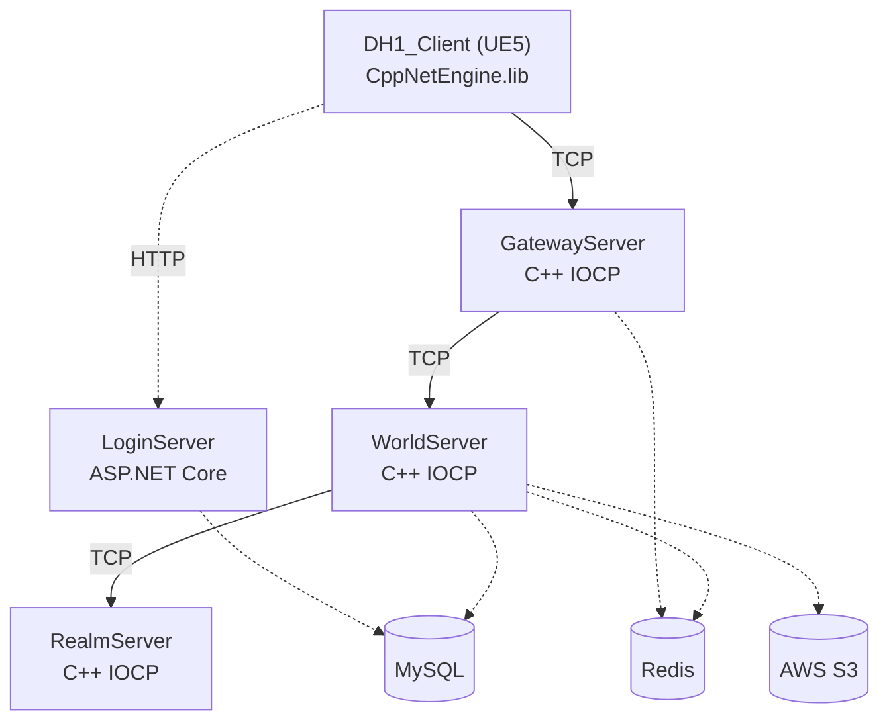
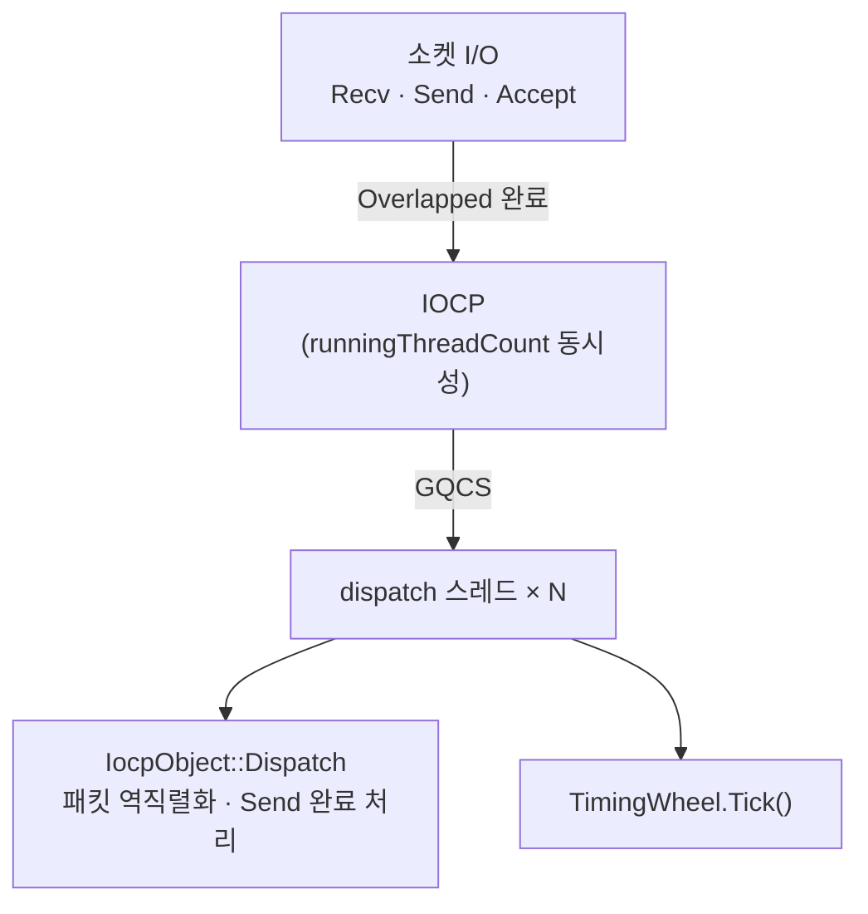
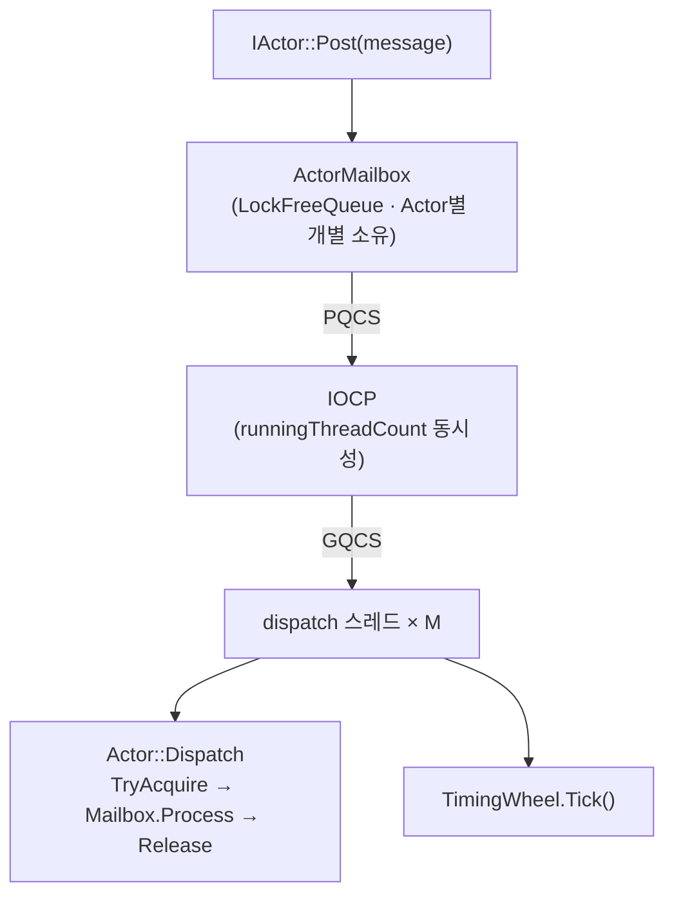
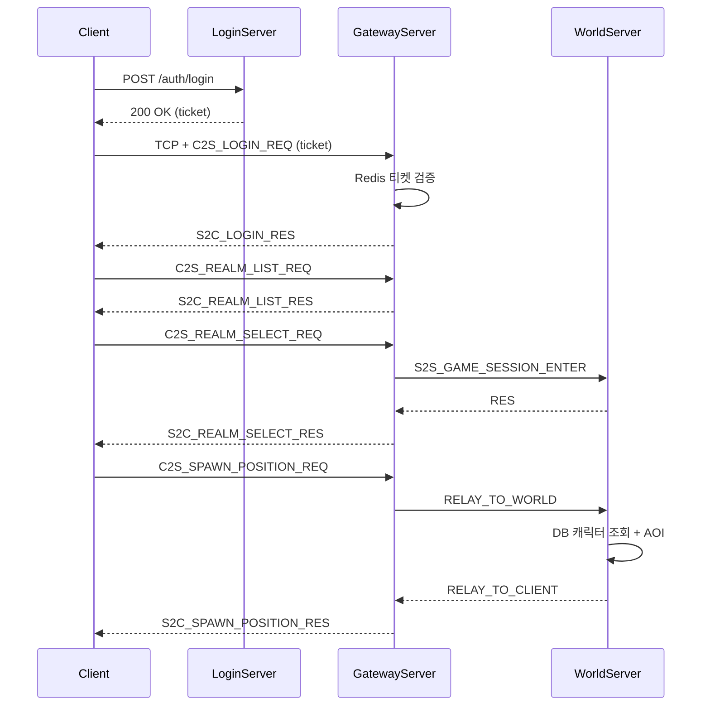
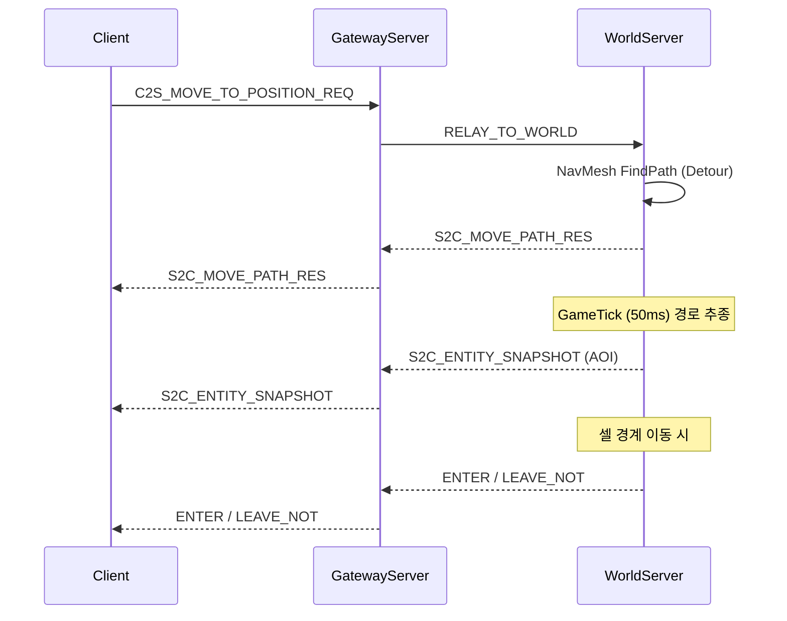
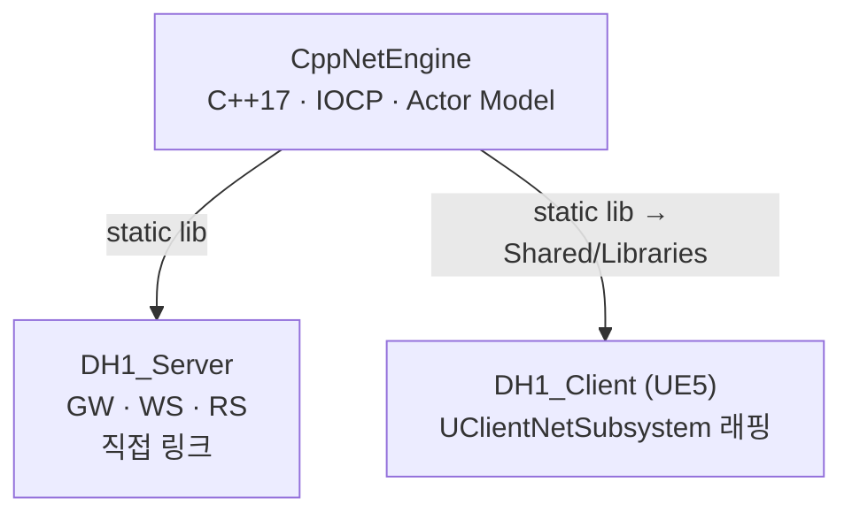
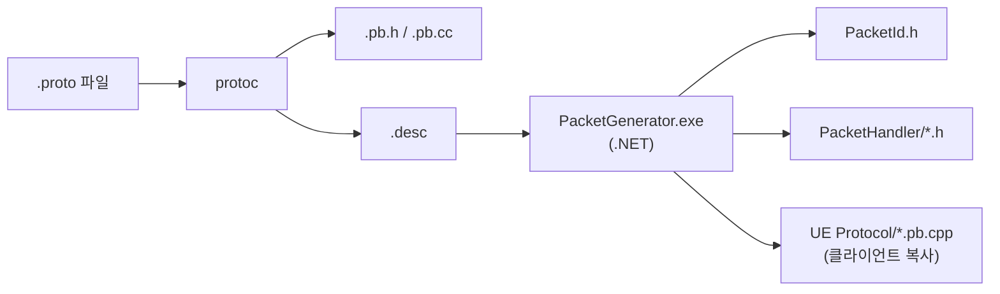

# DH1_MMORPG

> C++ IOCP 커스텀 네트워크 엔진으로 서버와 클라이언트를 동시에 구동하는 MMORPG 프로젝트

**CppNetEngine** — C++17 Windows IOCP 기반 Actor Model 네트워크 엔진을 직접 설계하고, 이를 **4개의 서버 프로세스**(Gateway · World · Realm · Login)와 **Unreal Engine 5.7 클라이언트**에 동일하게 적용했습니다. 서버 엔진을 static lib로 이식하여 **서버·클라이언트가 같은 네트워크 스택**을 공유합니다.

<br>

---

### 기술 스택

| 영역 | 기술 |
|------|------|
| 네트워크 엔진 | C++17 · Windows IOCP · Actor Model · Lock-free Queue/Stack |
| 서버 (GW / WS / RS) | C++17 · CppNetEngine (static lib) |
| 서버 (Login) | C# · ASP.NET Core 10 · Entity Framework Core |
| 클라이언트 | Unreal Engine 5.7 · C++ · CppNetEngine 이식 |
| 프로토콜 | Protocol Buffers 3 + 커스텀 PacketGenerator (.NET) |
| 데이터 | MySQL · Redis (세션 · Pub/Sub) · AWS S3 (NavMesh) |
| 인프라 | mimalloc · spdlog · Crashpad · vcpkg |
| CI | GitHub Actions (PacketGenerator 빌드 + LoginServer 단위 테스트) |

<br>

---

## 시스템 아키텍처



| 서버 | 역할 |
|------|------|
| **GatewayServer** | 클라이언트 TCP 접속점. 패킷 인증·라우팅, 세션 관리, 하트비트 검사 |
| **WorldServer** | 게임 로직. NavMesh 경로탐색, AOI 엔티티 관리, GameTick (50ms), 채팅 라우팅 |
| **RealmServer** | 서버 목록 관리. WorldServer 등록/상태, 렐름 선택 조율 |
| **LoginServer** | 계정 인증 (이메일/비밀번호). HTTP REST API, 이메일 인증, 세션 티켓 발급 |

<br>

---

## 스레드 모델

각 C++ 서버 프로세스는 **두 개의 완전 독립 IOCP 스케줄러**를 사용합니다. 각 스케줄러는 자체 IOCP 핸들과 스레드 풀을 가지며, 서로 직접 연결되지 않습니다.

### NetworkScheduler

소켓 I/O 전담. Overlapped I/O 완료를 GQCS로 수신하여 처리합니다.



### ActorScheduler

게임 로직 전담. 소켓을 사용하지 않고, `PostQueuedCompletionStatus`로 Actor를 깨웁니다.



| 컴포넌트 | 설명 |
|----------|------|
| **NetworkScheduler** | 독립 IOCP. 소켓 핸들을 IOCP에 등록, Overlapped Recv/Send/Accept 완료 디스패치 |
| **ActorScheduler** | 독립 IOCP. 소켓 없음. PQCS로 Actor 워크 아이템을 전달하는 수동 완료 큐 |
| **ActorMailbox** | Actor별 `LockFreeQueue<MessageRef>`. 메시지 Post 시 PQCS로 ActorScheduler에 통지 |
| **Actor** | `IActor` 구현. 단일 `atomic<bool>` 플래그로 `TryAcquire/Release` — 한 번에 하나의 dispatch 스레드만 처리 |
| **ScopedActor** | `IActor` 구현 (`Actor` 비상속). **복수 Actor를 ID 순 정렬 후 일괄 Acquire** → 자체 Mailbox 처리 → 역순 Release. 데드락 방지를 위한 고정 순서 잠금 + 재시도/백오프 내장 |
| **TimingWheel** | 각 스케줄러에 독립 존재. Dispatch() 루프마다 Tick(), 하트비트·타임아웃 등 스케줄링 |

스레드 수는 `*ServerConfig.json`에서 설정합니다 (`runningThreadCount: 0` → CPU 코어 자동 산정).

```json
{
  "networkScheduler": { "runningThreadCount": 2, "dispatchThreadCount": 8 },
  "actorScheduler":   { "runningThreadCount": 2, "dispatchThreadCount": 4 }
}
```

<br>

---

## 패킷 흐름

### 로그인 → 월드 진입



### 이동 (서버 사이드 NavMesh 경로탐색)



<br>

---

## CppNetEngine → UE5 클라이언트 이식

서버와 클라이언트가 **동일한 네트워크 엔진**을 사용합니다.



| 항목 | 구현 |
|------|------|
| **라이브러리 배포** | `CppNetEngine.lib` → `Shared/Libraries/CppNetEngine/{Debug,Release}/` |
| **UE5 매크로 충돌** | `NetEngineWrapper.h` — `check`, `verify`, `cast` 매크로 push/pop 후 엔진 헤더 포함 |
| **UE5 생명주기 통합** | `UClientNetSubsystem` (`UGameInstanceSubsystem` + `FTickableGameObject`) |
| **프로토콜 코드 공유** | 서버·Echo는 `Shared/Protocol` 직접 컴파일, UE는 PacketGenerator가 `Network/Protocol`로 복사 |
| **빌드 통합** | `DH1_Client.Build.cs`에서 vcpkg + CppNetEngine.lib 링크 |

`UClientNetSubsystem`은 CppNetEngine의 `ClientService` + `NetworkScheduler`를 생성하고, UE `Tick()`에서 `Dispatch()`를 호출하여 수신 패킷을 게임 스레드로 전달합니다.

<br>

---

## PacketGenerator (패킷 코드 자동화)

`.proto`에 **커스텀 옵션**으로 패킷 메타데이터를 선언하면, C++ 쪽 **수신 등록·송신 헬퍼·통합 디스패처**와 **PacketId enum**이 자동 생성됩니다.  
실행은 `Shared/BuildScripts/PacketGenerator.bat` 한 번으로 **protoc 컴파일 + 생성기 실행**까지 묶여 있습니다.

### 처리 파이프라인



1. **protoc** — `Shared/vcpkg`의 `protoc.exe`로 `.proto` → `Shared/Protocol/*.pb.h`, `*.pb.cc` 및 `Proto/*.desc` (descriptor set).
2. **PacketGenerator** — `.desc`를 읽어 패킷 목록을 파싱한 뒤, 역할(Role)별로 C++ 헤더를 씁니다.
3. **클라이언트 동기화** — `CLIENT` 역할에 필요한 `.pb.h` / `.pb.cc`(→`.pb.cpp`로 복사)와 `PacketId.h`를 UE 모듈 경로로 복사합니다.

### Protobuf 커스텀 옵션 (`PacketOption.proto`)

| 확장 대상 | 필드 | 의미 |
|-----------|------|------|
| `FileOptions` | `service_type` (50001) | 이 파일이 속한 서비스 타입 enum (`eServiceType`) — 디스패처 그룹핑 |
| `FileOptions` | `handler_name` (50002) | 생성될 핸들러 클래스 접두어 (예: `LoginPacketHandler`) |
| `MessageOptions` | `packet_id` (50003) | 패킷 ID (enum 값) |
| `MessageOptions` | `sender` (50004) | 송신 주체 `eRole` |
| `MessageOptions` | `receiver` (50005) | 수신 주체 `eRole` (복수 가능) |

역할(`eRole`)과 서비스 타입(`eServiceType`)은 `Enum.proto`에 정의되어 있으며, 생성기는 **수신자에 현재 프로젝트 역할이 포함된 메시지**에만 `HandleRecv` 등록 코드를 넣고, **송신자가 현재 역할인 메시지**에만 `MakeSendBuffer` 헬퍼를 생성합니다.

### 프로젝트 설정 (`Shared/Config/Tools/PacketGeneratorConfig.json`)

`projects` 배열에 **출력 루트 경로**와 **역할 문자열**을 지정합니다. 예:

| `name` (프로젝트 내 상대 경로) | `role` |
|-------------------------------|--------|
| `DH1_Server/GatewayServer` | `GATEWAY_SERVER` |
| `DH1_Server/WorldServer` | `WORLD_SERVER` |
| `DH1_Server/RealmServer` | `REALM_SERVER` |
| `DH1_Client/Source/DH1_Client/Network` | `CLIENT` |
| `DH1_Engine/EchoServer`, `EchoClient` | `ECHO_SERVER`, `ECHO_CLIENT` |

`clientProtocolPath`가 설정되어 있으면, 클라이언트가 송수신에 실제로 쓰는 proto 집합만 골라 `DH1_Client/.../Network/Protocol` 아래로 복사합니다. 기본으로 **Enum / Struct / PacketOption**은 항상 포함되고, 나머지는 패킷 메타데이터에 따라 필터링됩니다. `.pb.cc`는 UBT가 스캔하는 `.pb.cpp` 이름으로 복사해 **클라이언트 모듈 단일 컴파일 단위**로 맞춥니다.

### 자동 생성 산출물

| 산출물 | 위치 | 내용 |
|--------|------|------|
| `PacketId.h` | `Shared/Protocol/PacketId/` (및 UE `Network/Protocol/PacketId/`) | proto 파일별 `eXxxPacketId` enum |
| `{HandlerName}.h` | 각 타깃의 `PacketHandler/` | `HandleRecv` 등록, 수신 처리 함수 선언, `MakeSendBuffer` 정적 메서드 |
| `PacketServiceTypeHandler.h` | 각 타깃의 `PacketHandler/` | 서비스 타입별 핸들러 include·초기화·`InitPacketHandlers` 한곳 모음 |

생성된 `.h`는 **수정 금지(재생성 시 덮어씀)** 로 두고, 실제 게임 로직은 동일 이름의 `.cpp` 구현부에서 연결하는 패턴을 사용합니다.

### 실행 방법

- 일반: `Shared\BuildScripts\PacketGenerator.bat` (vcpkg `protoc` 필요)
- `BuildAll.bat`는 기본적으로 PacketGenerator를 포함한 전체 순서로 빌드합니다 (`--skip-proto` 시 proto 단계 생략).

<br>

---

## 핵심 기능

| 기능 | 설명 |
|------|------|
| **커스텀 IOCP 엔진** | Actor Model · Lock-free Queue/Stack · ObjectPool · MemoryPool · TimingWheel · SendBuffer 할당기 |
| **AOI** | `GridManager` 기반 셀 분할 (2000 유닛). 셀 경계 이동 시 Enter/Leave 자동 브로드캐스트 |
| **서버 사이드 NavMesh** | UE5 Detour를 서버에서 직접 로드 → 서버 권위적 경로 탐색. S3에서 바이너리 다운로드 |
| **PacketGenerator** | `.proto` 커스텀 옵션 → PacketId · Handler · UE 프로토콜 자동 생성 (상세: 하단 별도 섹션) |
| **Relay 패턴** | Gateway ↔ World 간 `RELAY_TO_CLIENT` / `RELAY_TO_WORLD`로 패킷 투명 중계 |
| **하트비트 · 세션** | 양방향 하트비트 + Redis 세션 TTL + 중복 로그인 Kick + SessionReaper 자동 정리 |
| **인게임 채팅** | LOCAL (AOI 범위) / WORLD (전체). Redis Pub/Sub 크로스 서버 라우팅 |
| **캐릭터** | 캐릭터 생성 · 오버헤드 UI (이름·레벨·HP) · 스폰 위치 동기화 |
| **크래시 리포팅** | Crashpad 미니덤프 수집 (`CrashReporter` + `crashpad_handler.exe`) |

<br>

---

## 프로젝트 구조

```
DH1_MMORPG/
├── DH1_Engine/                  # CppNetEngine (C++ IOCP 네트워크 엔진, static lib)
│   ├── CppNetEngine/            #   IOCP, Actor, Session, Scheduler, LockFree, MemoryPool ...
│   ├── EchoServer/              #   엔진 테스트용 Echo 서버
│   └── EchoClient/              #   엔진 테스트용 Echo 클라이언트
│
├── DH1_Server/
│   ├── GatewayServer/           # 클라이언트 TCP 접속 관문 (C++ IOCP)
│   ├── WorldServer/             # 게임 로직, NavMesh, AOI, GameTick (C++ IOCP)
│   ├── RealmServer/             # 서버 목록 · 월드 등록 관리 (C++ IOCP)
│   ├── LoginServer/             # 계정 인증 REST API (C# ASP.NET Core 10)
│   ├── LoginServer.Tests/       # LoginServer 단위 테스트
│   └── DbMigration/             # EF Core 데이터베이스 마이그레이션
│
├── DH1_Client/                  # Unreal Engine 5.7 클라이언트
│   ├── Source/DH1_Client/
│   │   ├── Network/             #   CppNetEngine 래퍼, 패킷 핸들러, NetSubsystem
│   │   ├── Controllers/         #   플레이어 컨트롤러
│   │   ├── Core/                #   GameMode, NavMesh Exporter
│   │   ├── UI/                  #   위젯 (로그인, 채팅, 오버헤드 등)
│   │   └── Misc/                #   유틸리티
│   └── Plugins/                 #   FlopAI, UnrealMCP 등 에디터 플러그인
│
├── Shared/
│   ├── BuildScripts/            # 빌드 · 실행 · 검증 스크립트 (bat)
│   ├── Config/                  # 서버/클라이언트/도구 JSON 설정
│   ├── Protocol/                # Protobuf 정의 (.proto) 및 생성 코드
│   ├── NavMesh/                 # 서버용 NavMesh 바이너리
│   ├── NavmeshUE5/              # UE5 Detour 소스 (서버 컴파일용)
│   ├── Libraries/CppNetEngine/  # 클라이언트용 엔진 lib (Debug/Release)
│   ├── Tools/
│   │   ├── PacketGenerator/     #   .proto → PacketId·핸들러 코드 생성기 (.NET)
│   │   └── CrashHandler/        #   crashpad_handler.exe
│   └── vcpkg/                   # 패키지 의존성 (spdlog, protobuf, redis++ 등)
│
├── Binaries/                    # 빌드 산출물 (Server/{Debug,Release}/...)
├── Logs/                        # 서버·클라이언트 로그
└── .github/workflows/ci.yml     # GitHub Actions CI
```

<br>

---

## 빌드

### 사전 요구사항

| 항목 | 버전 |
|------|------|
| Visual Studio | 2025 (v18.x) — `.vsconfig`로 필요 컴포넌트 설치 |
| .NET SDK | 10.0.201 (`global.json`으로 고정) |
| Unreal Engine | 5.7 |
| vcpkg | `Shared/vcpkg/vcpkg.json` 참조 (spdlog, protobuf, redis-plus-plus, mimalloc 등) |

### 전체 빌드

PacketGenerator → Engine → Server → UE 클라이언트 순서로 빌드합니다.

```batch
Shared\BuildScripts\BuildAll.bat           # Debug
Shared\BuildScripts\BuildAll.bat Release   # Release
Shared\BuildScripts\BuildAll.bat --skip-proto   # proto 생성 건너뛰기
```

### 패킷 코드 생성

`.proto` 파일 수정 후 실행합니다.

```batch
Shared\BuildScripts\PacketGenerator.bat
```

### 검증 테스트

CI와 동일한 최소 점검을 로컬에서 수행합니다 (.NET SDK 10.0.201 필요).

```batch
Shared\BuildScripts\RunValidationTests.bat
Shared\BuildScripts\RunValidationTests.bat --full   # proto 컴파일 + Echo 엔진 빌드 포함
```

> VS Code에서는 `Ctrl+Shift+B` → 빌드 태스크 선택으로도 실행 가능합니다.

<br>

---

## 서버 실행

```batch
Shared\BuildScripts\StartServers.bat          # 서버만 실행 (Debug)
Shared\BuildScripts\StartServers.bat Release  # 서버만 실행 (Release)

Shared\BuildScripts\StartGame.bat             # 서버 + 클라이언트 실행
```

실행 순서: **RealmServer → WorldServer → GatewayServer → LoginServer** → (클라이언트)

각 서버는 프로세스 존재·TCP 포트·HTTP 헬스체크를 순차 확인한 뒤 다음 단계로 진행합니다.

<br>

---

## 환경 설정

```bash
# .env.example을 복사해 값을 채워주세요
cp .env.example .env
```

환경 설정은 `.env` 단일 파일 기준으로 운영합니다.

- `.env`: 로컬 실행용 환경 변수 (커밋 금지, `.gitignore` 적용)
- `.env.example`: 템플릿 (커밋 대상)

| 변수 | 설명 |
|------|------|
| `DH1_MYSQL_HOST` | MySQL 호스트 (기본: 127.0.0.1) |
| `DH1_MYSQL_PORT` | MySQL 포트 (기본: 3306) |
| `DH1_MYSQL_USER` | MySQL 사용자 |
| `DH1_MYSQL_PASSWORD` | MySQL 비밀번호 |
| `DH1_REDIS_HOST` | Redis 호스트 (기본: 127.0.0.1) |
| `DH1_REDIS_PORT` | Redis 포트 (기본: 6379) |
| `DH1_S3_REGION` | `s3://` 사용 시 AWS 리전 (`ap-northeast-2` 등) |
| `DH1_NAVMESH_CACHE_PATH` | S3에서 내려받은 NavMesh 로컬 캐시 경로 |
| `DH1_SMTP_HOST` | SMTP 서버 주소 (예: smtp.gmail.com) |
| `DH1_SMTP_SENDER_EMAIL` | 발신자 이메일 주소 |
| `DH1_SMTP_APP_PASSWORD` | SMTP 앱 비밀번호 (Gmail 기준: 앱 비밀번호) |
| `DH1_LOG_DIR` | CppNetEngine 파일 로그 경로 (미설정 시 콘솔만 출력) |
| `DH1_CRASH_DIR` | 크래시 덤프 저장 경로 |
| `DH1_CRASH_HANDLER_PATH` | crashpad_handler.exe 절대 경로 |

`Shared/Config/Server/WorldServerConfig.json`의 `gameTick.navMeshRequireSuccess`가 `true`이면(기본값)
NavMesh 다운로드/로딩 실패 시 WorldServer는 fail-fast로 기동을 중단합니다.

### NavMesh 소스 DB (필수)

WorldServer는 `world_navmesh_source` 테이블이 있으면 `world_server_id + map_code` 기준으로 NavMesh 경로를 먼저 조회합니다.
NavMesh 소스는 `s3://bucket/key`만 지원합니다.

```sql
CREATE TABLE world_navmesh_source (
  id BIGINT AUTO_INCREMENT PRIMARY KEY,
  world_server_id INT NOT NULL,
  map_code VARCHAR(64) NOT NULL,
  navmesh_path VARCHAR(1024) NOT NULL,  -- s3://bucket/key
  navmesh_version INT NULL,
  is_active TINYINT(1) NOT NULL DEFAULT 1,
  UNIQUE KEY uq_world_map (world_server_id, map_code, is_active)
);
```

### 권장 운영 방식 (IAM)

- EC2(또는 서버)에 IAM Role 부여 (`s3:GetObject`)
- 서버에 AWS CLI 설치
- `world_navmesh_source.navmesh_path`를 `s3://...`로 관리
- WorldServer 시작 시 `aws s3 cp`로 캐시에 내려받아 로드

#### 최소 권한 정책 예시

- 파일: `Shared/Config/Server/IamPolicy.NavMeshReadOnly.example.json`
- 버킷명/접두어를 실제 운영 값으로 바꿔서 IAM Role에 연결

```bash
# 권한 연결 후 테스트 (서버 머신)
aws s3 ls s3://dh1-navmesh-prod/navmesh/ --region ap-northeast-2
aws s3 cp s3://dh1-navmesh-prod/navmesh/L_GameWorld.bin C:/Temp/L_GameWorld.bin --region ap-northeast-2
```
